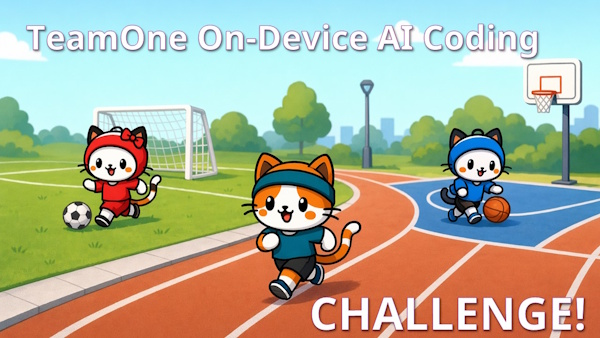
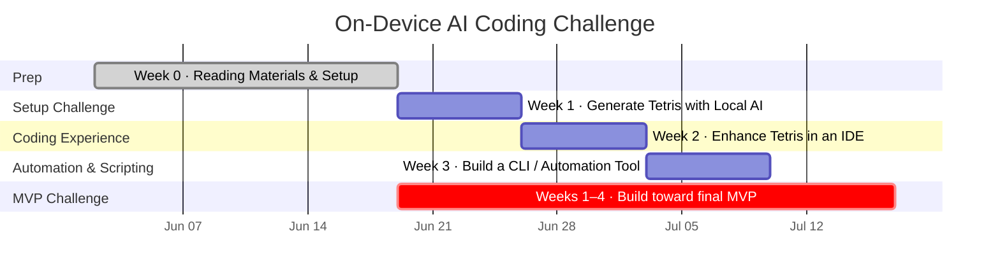

# On-Device AI Coding - Weekly Challenges

## 🚀 Overview
A 4-week progressive hands-on challenge focused on building practical skills in **on-device AI**, **local inference**, and **AI-assisted coding workflows**.

**Format:** All-virtual. Challenges are self-paced within each week, with a live kickoff session before the final week. Deliverables are pre-defined — no synchronous agreement needed to start.

---

## 📅 Week 1 — Setup Challenge
**Theme:** Make it work locally

### Objective
Set up a working local AI inference on a UNICEF laptop, use chat, code with chat.

### Deliverable
- One-file **colorful HTML Tetris game** generated using local AI
- Must use a **local inference engine** — no cloud AI
- Generated via the engine's **chat UI**, no coding IDE required

---

## 💻 Week 2 — Coding Experience Challenge
**Theme:** Make it better!

### Objective
Adopt a local coding environment and iteratively improve our tetris game.

### Deliverable
- Enhanced Tetris with at least **two new features** (e.g. score board, levels, web engine, next-piece preview, sound, game-over screen)
- Must use a **local model connected to an IDE**
- Submit the project as a single-file web app

---

## 🔧 Week 3 — Automation & Scripting Challenge
**Theme:** Make it practical

### Objective
Pick a meaningful use case, Build a useful scripting or CLI solution.

### Deliverable
- A runnable **CLI script or automation tool** that solves a real task in your daily work
- Examples: log analyzer, user provisioning script, batch file processor, system health checker
- Must include a short README or header comment explaining what it does and how to run it

---

## 🚀 Week 4 — MVP Challenge
**Theme:** Make it real

> **Starts at the time of the virtual kickoff session.** Scope and team pairing confirmed at kickoff — attend or coordinate async within 24 hours.

### Objective
Deliver a minimum viable product using local AI that demonstrates clear, practical value.

### Deliverable
- A functional application or tool with a **defined user and use case**
- Must be **demo-able live** (screen share or recorded video walkthrough)
- Built primarily with local AI assistance — document which model and tools you used
- Simple enough to be demo'd in 10 minutes:
  - 5 min · Demo
  - 3 min · Code walkthrough
  - 2 min · Q&A

---

## 🏁 Scoring Criteria

Each submission is scored (1–5 each):

| Criteria | Description |
|----------|------------|
| Functionality | Does it work? |
| Use of On-Device AI | Effective use of local AI |
| Creativity | Innovation and approach |
| Practical Value | Real-world usefulness |

---

## 🤝 Participation Model

- **Solo**: Individual ownership
- **Duo**: Paired collaboration

---

## ✅ Final Note

Every submission must be:
- Runnable / demo-able
- Marked as:
  - 👍 Validated
  - 👎 Not validated

---

## 📤 Submitting Your Work

All deliverables are submitted to the shared repository via **Pull Request**. This is intentional — the PR workflow is part of what you're practicing. If you haven't worked with Git or GitHub before, the submission process is where that skill starts. The Week 0 setup tasks get you access; each weekly submission builds the habit.

### The Process

For each week:

1. Create a branch (or work from your fork)
2. Go to `submissions/week-N/`
3. Create a subfolder named after your GitHub username: `submissions/week-N/your-username/`
4. Add your deliverable files
5. Complete and include a `NOTES.md` using the template in that week's submission folder
6. Open a Pull Request titled `[Week N] your-username`

Your PR is your submission. It gets reviewed, validated, and merged — or returned with specific notes on what's missing.

### The NOTES.md

Every submission includes a `NOTES.md`. This document captures what you ran, what you observed, and what worked or didn't — directly from your experience. These notes feed the [collective findings](findings/README.md) that the group builds together throughout the engagement. The more specific and honest, the more useful the output is for Corporate colleagues who weren't here.

Filling in the NOTES.md is not an add-on. It is part of the submission.

### Validation

Each submission is reviewed against the week's deliverable criteria and marked:

- 👍 **Validated** — deliverable meets the criteria, NOTES.md is completed
- 👎 **Not validated** — with specific notes on what's missing or needs correction

### If You Can't Complete the Challenge

Submit anyway. A completed `NOTES.md` documenting what you tried, where it stopped, and why is a valid and complete contribution. Whether your hardware couldn't run the stack, a blocker came up, or the approach simply didn't work — that's data. "Not achievable on this hardware" is a finding, not a failure.

### Submission Folders

| Week | Folder | Deliverable |
|:---|:---|:---|
| Week 1 | [submissions/week-1/](submissions/week-1/README.md) | One-file Tetris, generated via local AI |
| Week 2 | [submissions/week-2/](submissions/week-2/README.md) | Enhanced Tetris, built with local AI + IDE |
| Week 3 | [submissions/week-3/](submissions/week-3/README.md) | CLI tool or automation script |
| Week 4 | [submissions/week-4/](submissions/week-4/README.md) | MVP application |

Each folder has a README with the full submission guide and the NOTES.md template for that week.

