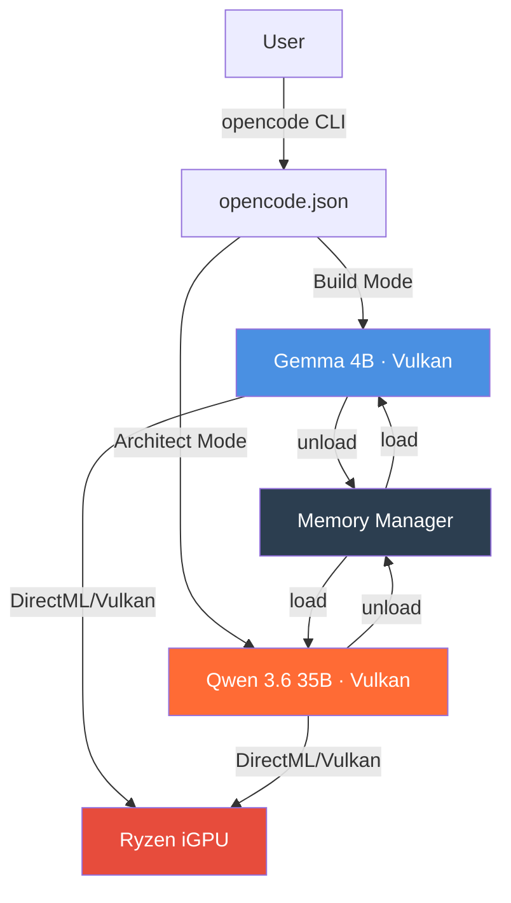

# RyzenAI Local Coding Setup

### 32GB RAM · Ryzen iGPU · Vulkan Backend

  
  
  

**CLI-first local LLM orchestration for RyzenAI systems.**  
Configure your 32GB RAM rig to run Gemma 4B (Build) and Qwen 3.6 35B (Architect) with Vulkan acceleration.

---

## 🎯 Objectives

| Goal | Detail |
|:---|:---|
| **Performance-First** | Vulkan backend for iGPU acceleration on Ryzen AI hardware |
| **Stability** | Single-Active-Model memory policy prevents system paging |
| **CLI-Driven** | All setup via Windows Terminal — no GUI required |
| **Reproducible** | `winget` installs, documented configs, authoritative references |

---

## 🏗 Architecture Overview

**Key Design Decisions:**
- **Single Active Model**: Only one model resident in memory at a time
- **32k Context / 1 Concurrency**: Optimized for 32GB RAM stability
- **Vulkan Backend**: Hardware-accelerated inference via Vulkan ICD

---

## 📁 Documentation Structure

| File | Purpose |
|:---|:---|
| [`QUICKSTART.md`](QUICKSTART.md) | Step-by-step CLI setup guide |
| [`SETUP.md`](SETUP.md) | Environment configuration & Vulkan setup |
| [`CONFIG.md`](CONFIG.md) | `opencode.json` schema & usage |
| [`NOTES.md`](NOTES.md) | Technical justification & authoritative references |

---

## ⚡ Quick Links

- [Start Setup](QUICKSTART.md) — Get running in 5 minutes
- [Configure opencode](CONFIG.md) — Memory policy & model definitions
- [Technical Notes](NOTES.md) — Why we chose Vulkan, memory limits, and constraints

---

*Built for the RyzenAI community. Optimize. Iterate. Deploy.*

