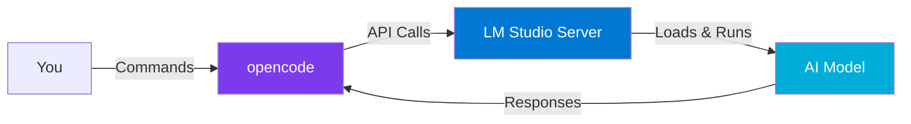

<div align="center">


# Local AI Coding on Windows 11

### Professional Skill-Building: On-Device AI Coding

<div style="margin: 20px 0;">
  
  
</div>

**Add local AI coding to your professional toolkit.**  
Generate PowerShell scripts, troubleshoot systems, document infrastructure—all without sending data to the cloud.

</div>

---

## Why This Matters

You're an IT professional—support, network, infrastructure, maybe development. You have deep expertise in your domain. This guide helps you add a new capability: running powerful AI models locally for daily work. Generate automation scripts, troubleshoot error messages, write documentation. Practical tasks that justify the setup time.

**What makes this different:** No cloud dependencies, no data leaving your organization, no monthly subscriptions. Your hardware, your models, your data.

---

## What This Covers

This documentation covers a specific starting-point stack for 32GB Windows 11 systems — an **inference engine** (to run models locally), a **local open-weights model**, and a **coding interface** (to connect your IDE to the running model).

The [technical documentation](SETUP.md) uses a concrete example stack so instructions are copy-paste ready. The [findings](findings/README.md) reflect what participants actually validated across different hardware and tooling combinations — including alternatives to the example stack.

> **16GB systems:** See sidebars throughout the documentation for smaller model alternatives that work within tighter memory constraints.

---

## 🏗 How It Fits Together



**Key constraints for 32GB:**
- **Context:** 32,768 tokens
- **Concurrency:** 1 request at a time  
- **Single model:** Unload before loading another (RAM physics, not ceremony)

These are tested defaults that keep everything stable when running other software alongside your AI tools.

---

## 📚 Documentation Structure

| Document | When to Read |
|:---|:---|
| **[QUICKSTART](QUICKSTART.md)** | Start here. Zero to running model in minimal steps. |
| **[SETUP](SETUP.md)** | After QUICKSTART works and you want to understand what you built. |
| **[CONFIG](CONFIG.md)** | When customizing model settings or switching between models. |
| **[CAVEATS](CAVEATS.md)** | Reality check: honest assessment of tradeoffs, costs, and limitations. |
| **[NOTES](NOTES.md)** | For design rationale, hardware recommendations, troubleshooting. |
| **[USE CASES](USE_CASES.md)** | See it in action: PowerShell generation and error troubleshooting. |
| **[READING MATERIALS](READING_LIST.md)** | Must Read Every Item. Take your own Notes, Investigate further when needed. |
| **[CHALLENGES](CHALLENGES.md)** | The 4-week hands-on challenge program. Deliverables, scoring, and timeline. |
| **[OUTCOMES](OUTCOMES.md)** | What this engagement produces, how work is organized, distributed, and marked complete. |
| **[SUBMISSIONS](submissions/README.md)** | How to submit challenge deliverables and capture your findings via Pull Request. |
| **[FINDINGS](findings/README.md)** | The engagement's institutional output: hardware assessment, use-case matrix, deployment template. |

---

## ⚡ Quick Start


Are you familiar with local AI setup already? Then you can use these three commands to get running:

```powershell
# Install LM Studio
winget install ElementLabs.LMStudio --accept-package-agreements --accept-source-agreements

# Download and start
lms get <model-name>
lms load <model-name> --context-length 32768 --parallel-requests 1
```

DO you need step-by-step guidance? Then follow [QUICKSTART.md](QUICKSTART.md) for the complete setup sequence.

---

## Who This Serves

**Primary:** Field IT Pros learning to add AI coding to their toolkit. You might not have touched git or developer workflows before—that's fine. We explain what matters without assuming developer background.

**Also useful for:** Developers (who already know opencode), Infrastructure Architects, Software Architects, Specialists/SMEs, IT Team Managers.

If you're a professional looking to expand your capabilities with practical AI tools, this documentation is for you.

---

<div align="center">

**[Start Setup →](QUICKSTART.md)**

*Local models. Local data. Your expertise, amplified.*

---

 

</div>
